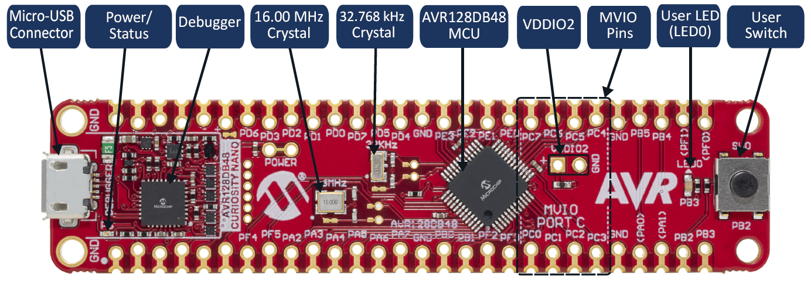
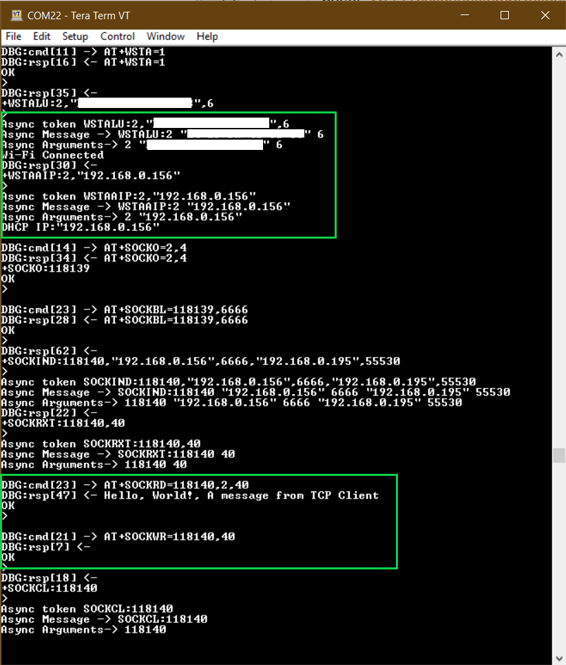
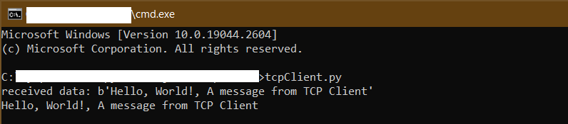

# TCP Server

This RNWF02 application implements a TCP Server.

## Description

In this application RNWF02 will host a TCP Server in Wi-Fi STA mode. The user would need to configure the Wi-Fi credentials for Home-AP and port number at which the TCP server would be listening. The default application will connect to Home-AP and starts a TCP Server on the board. Once the TCP server-client connection is successful, the data exchange will take place.

## Hardware Requirements

- Host MCU [AVR128DB48 CURIOSITY NANO](https://www.microchip.com/en-us/product/AVR128DB48) with Curiosity Nano Base for Click Boards

      

- Wi-Fi module: RNWF02PC Add-on Board

## Software Requirements

- [MPLAB X IDE](https://www.microchip.com/en-us/tools-resources/develop/mplab-x-ide) (v6.05 and later) 
- [MPLAB Code Configurator](https://www.microchip.com/en-us/tools-resources/configure/mplab-code-configurator) (MCC v5) with MCC Melody Content Manager Tool (CMT)
- [MPLAB XC8 Compiler](https://www.microchip.com/en-us/tools-resources/develop/mplab-xc-compilers/downloads-documentation#XC8) (v2.41 or later)

## Downloading and building the application

To download or clone this application from Github, go to the [top level of the repository](../../)

Path of the application within the repository is **apps/tcp_server/rnwf02_tcp_server.X/** .

To build the application, refer to the following table and open the project using its IDE.
|Project Name|Description|
|------------|-----------|
|rnwf02_tcp_server.X|MPLABX project for AVR128DB48 Curiosity Nano and RNWF02 add-on Board|
| | |

## Running the Application

1. Mount AVR128DB48 Curiosity Nano and RNWF02 Add-on Boards over Curiosity Nano base for click boards, at the respective headers as shown below.

      

2. Connect the debugger USB port on the AVR128DB48 Curiosity Nano board to computer using a micro USB cable

3. Open the project and launch MCC with Melody Content Manager Tool

4. Configure Home-AP credentials for STA Mode, in [main.c](../tcp_server/rnwf02_tcp_server.X/main.c#L50)

5. Configure TCP Server details such as port number at which the server would be listening, in [main.c](../tcp_server/rnwf02_tcp_server.X/main.c#L56)

6. Build and program the code into the hardware using IDE

7. Open the Terminal application \(Ex.:Tera Term or PuTTY\) on the computer

8. Connect to the "USB to UART" COM port and configure the serial settings as follows:

    -   Baud : 115200
    -   Data : 8 Bits
    -   Parity : None
    -   Stop : 1 Bit
    -   Flow Control : None

9. As the board boots up, it will connect to Home-AP and print the IP address obtained. Once the TCP server-client connection is successful, the application will continue listening on the socket number configured for incoming messages and then write them back to the client connected.

      

      

