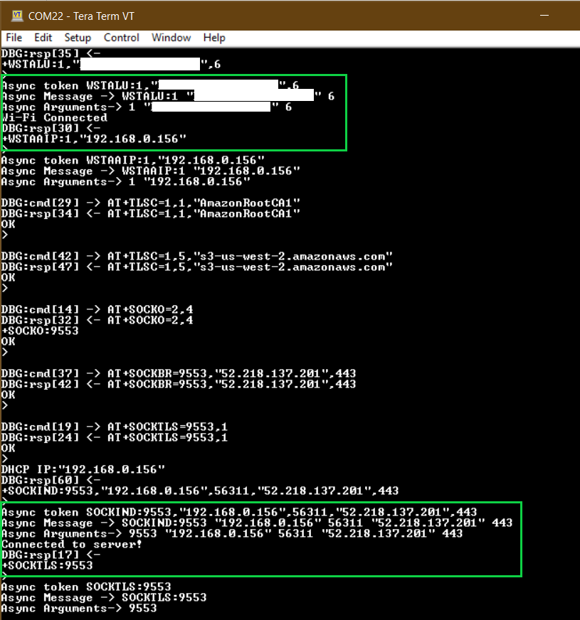
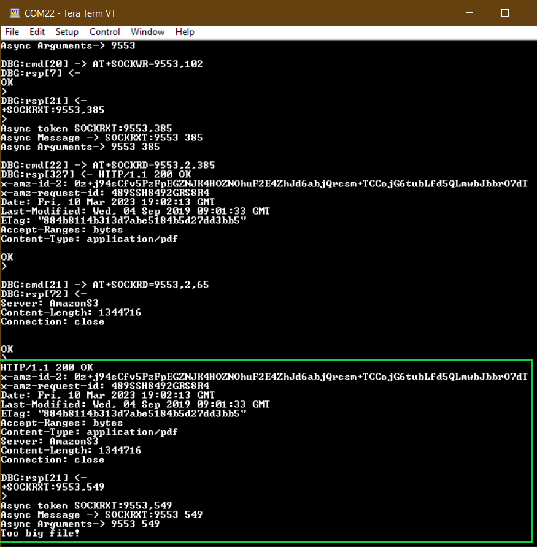

# TLS Client

This RNWF02 application acts as a TLS Client. In this application, the device will securely connect with AWS S3 and tries to read a document.

## Description

In this application RNWF02 will host a TLS Client in Wi-Fi STA Mode. The user would need to configure the Wi-Fi credentials for Home-AP. The default application will connect to Home-AP and establishes a connection with AWS S3.

## Hardware Requirements

- Host MCU [AVR128DB48 CURIOSITY NANO](https://www.microchip.com/en-us/product/AVR128DB48) with Curiosity Nano Base for Click Boards

  

- Wi-Fi module: RNWF02PC Add-on Board

## Software Requirements

- [MPLAB X IDE](https://www.microchip.com/en-us/tools-resources/develop/mplab-x-ide) (v6.05 and later) 
- [MPLAB Code Configurator](https://www.microchip.com/en-us/tools-resources/configure/mplab-code-configurator) (MCC v5) with MCC Melody Content Manager Tool (CMT)
- [MPLAB XC8 Compiler](https://www.microchip.com/en-us/tools-resources/develop/mplab-xc-compilers/downloads-documentation#XC8) (v2.41 or later)

## Downloading and building the application

To download or clone this application from Github, go to the [top level of the repository](../../)

Path of the application within the repository is **apps/tls_client/rnwf02_tls_client.X/** . 

To build the application, refer to the following table and open the project using its IDE.
|Project Name|Description|
|------------|-----------|
|rnwf02_tls_client.X|MPLABX project for AVR128DB48 Curiosity Nano and RNWF02 add-on Board|
| | |

## Running the Application

1. Mount AVR128DB48 Curiosity Nano and RNWF02 Add-on Boards over Curiosity Nano base for click boards at respective headers as shown below.

2. Connect the debugger USB port on the AVR128DB48 Curiosity Nano board to computer using a micro USB cable

3. Open the project and launch MCC with Melody Content Manager Tool

4. Configure Home-AP credentials for STA Mode, in [main.c](../tls_client/rnwf02_tls_client.X/main.c#L53)

5. Build and program the code into the hardware using IDE

6. Open the Terminal application \(Ex.:Tera Term or PuTTY\) on the computer

7. Connect to the "USB to UART" COM port and configure the serial settings as follows:

    -   Baud : 115200
    -   Data : 8 Bits
    -   Parity : None
    -   Stop : 1 Bit
    -   Flow Control : None

8. As the board boots up, it will connect to Home-AP and print the IP address obtained. The board will establish a connection with AWS S3 and print a success message. Once the TLS client-server connection is successful, the application will try to access/read the document listed.

