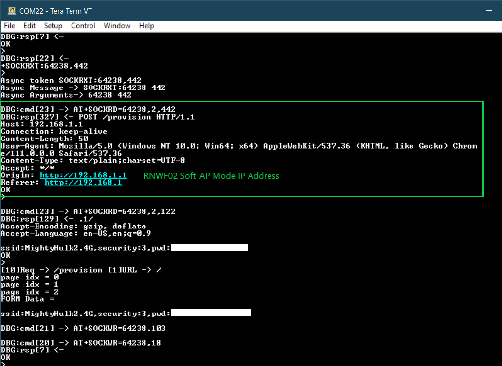
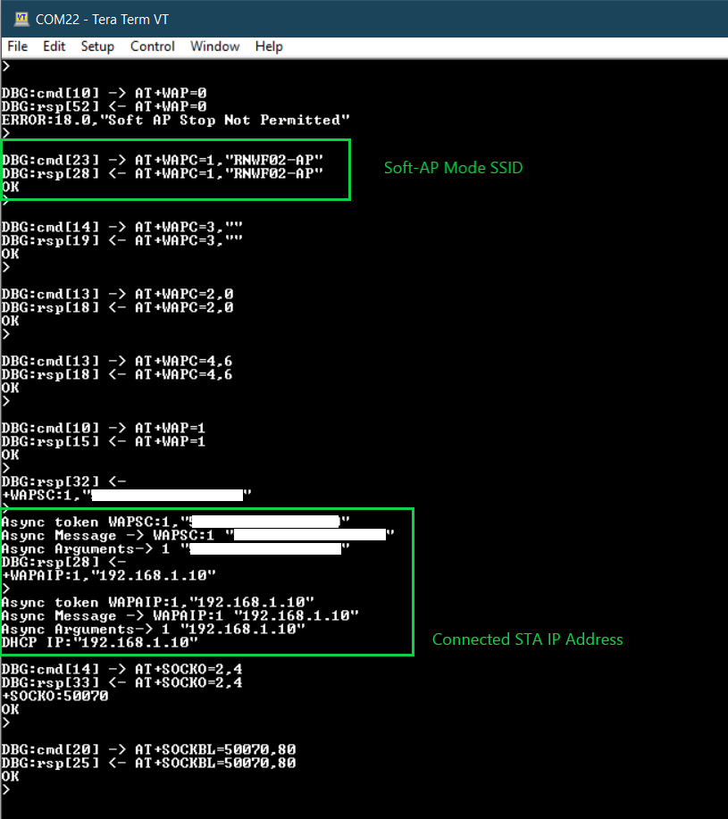
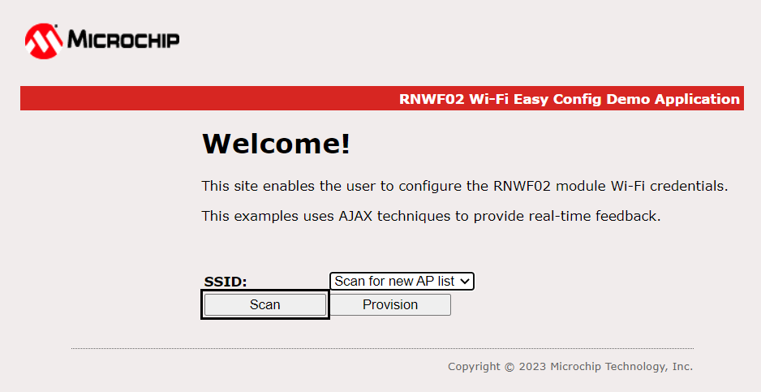
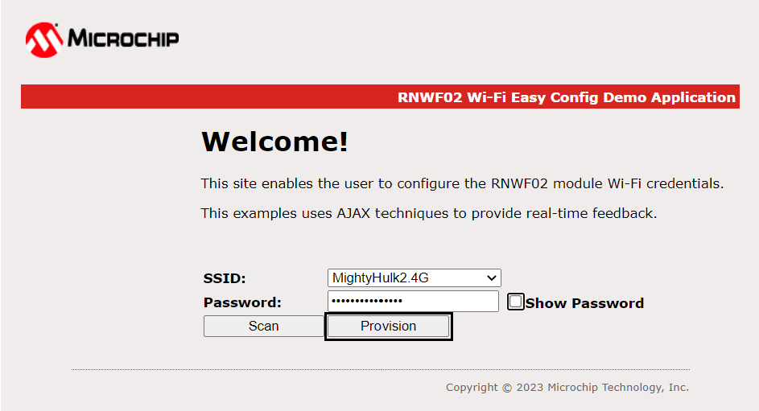
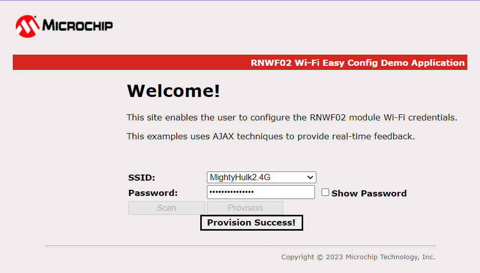
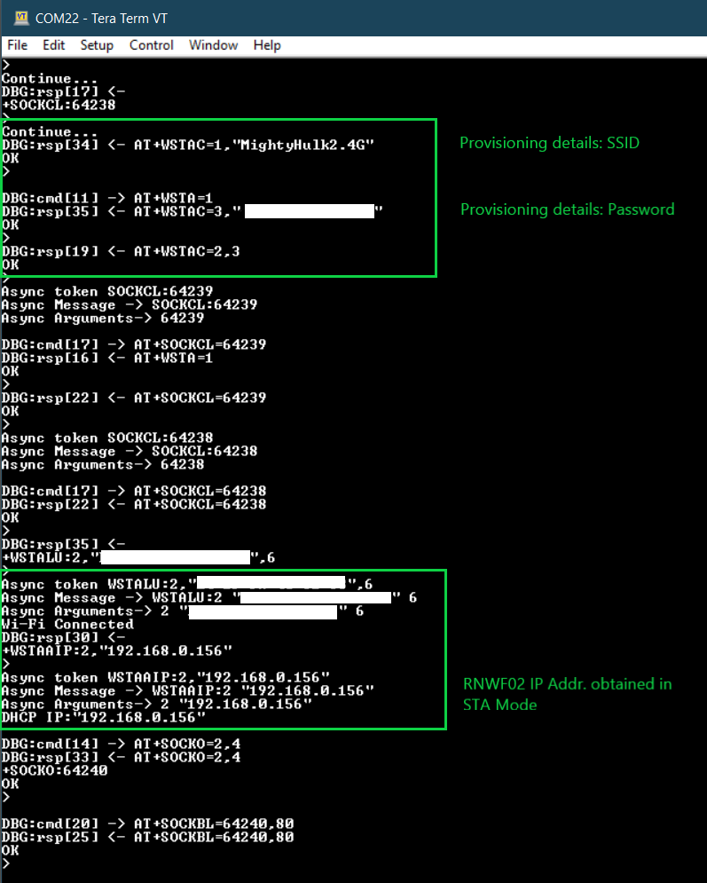

# Wi-Fi Easy Configuration

This RNWF02 application illustrates the use of Wi-Fi Soft-AP mode for Wi-Fi provisioning via HTTP.

## Description

This RNWF02 application demonstrates how a user can configure the device with the credentials of the Home-AP. The device will boot-up in Soft-AP mode, user will connect to Soft-AP via a third party STA (any laptop/mobile phone). User will then provide the Home-AP credentials to the device using HTTP webpage. Once this provisioning is successful, the device mode is set to Wi-Fi STA mode. It will then connect to the Home-AP and get an IP address.

## Hardware Requirements

- Host MCU [AVR128DB48 CURIOSITY NANO](https://www.microchip.com/en-us/product/AVR128DB48) with Curiosity Nano Base for Click Boards

  

- Wi-Fi module: RNWF02PC Add-on Board

## Software Requirements

- [MPLAB X IDE](https://www.microchip.com/en-us/tools-resources/develop/mplab-x-ide) (v6.05 and later) 
- [MPLAB Code Configurator](https://www.microchip.com/en-us/tools-resources/configure/mplab-code-configurator) (MCC v5) with MCC Melody Content Manager Tool (CMT)
- [MPLAB XC8 Compiler](https://www.microchip.com/en-us/tools-resources/develop/mplab-xc-compilers/downloads-documentation#XC8) (v2.41 or later)

## Downloading and building the application

To download or clone this application from Github, go to the [top level of the repository](../../)

Path of the application within the repository is **apps/wifi_easy_config/rnwf02_wifi_easy_config.X/** . 

To build the application, refer to the following table and open the project using its IDE.
|Project Name|Description|
|------------|-----------|
|rnwf02_wifi_easy_config.X|MPLABX project for AVR128DB48 Curiosity Nano and RNWF02 add-on Board|
| | |

## Running the Application

1. Mount AVR128DB48 Curiosity Nano and RNWF02 Add-on Boards over Curiosity Nano base for click boards at respective headers as shown below.

2. Connect the debugger USB port on the AVR128DB48 Curiosity Nano board to computer using a micro USB cable

3. Open the project and launch MCC with Melody Content Manager Tool

4. RNWF02 Wi-Fi Soft-AP mode credentials can be found at [main.c](../wifi_easy_config/rnwf02_wifi_easy_config.X/main.c#L47)

5. Build and program the code into the hardware using IDE

6. Open the Terminal application \(Ex.:Tera Term or PuTTY\) on the computer

7. Connect to the "USB to UART" COM port and configure the serial settings as follows:

    -   Baud : 115200
    -   Data : 8 Bits
    -   Parity : None
    -   Stop : 1 Bit
    -   Flow Control : None

8. The board will boot-up in Wi-Fi Soft-AP mode, as per the configurations given in step 4. Connect to the Soft-AP via a third party STA (any laptop/mobile phone). Soft-AP mode SSID and IP address will be available on the serial console as shown below:

9. Open the browser and enter the Soft-AP mode IP address(example: http://192.168.1.1/). 

10. Click on "scan", which will start a scan for new AP list. From the drop-down available, select the target Home-AP name fill-in the "Password" field for the selected Home-AP and click on "Provision".

11. Once the Wi-Fi provisioning is completed successfully, below message will appear on the HTTP webpage

12. The board will now connect to the Home-AP and get an IP address. The IP address is displayed on the serial console as shown:

